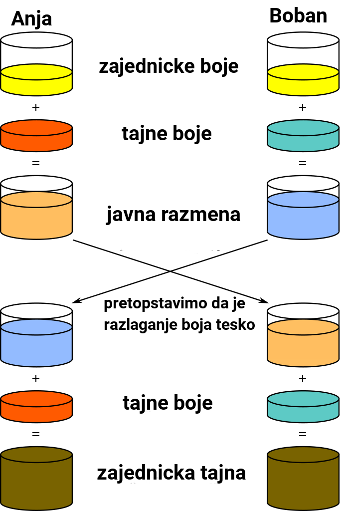
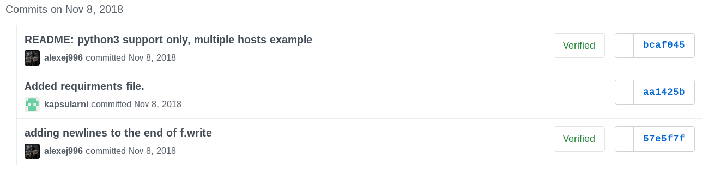
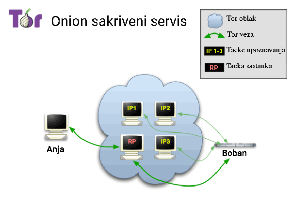

---
title:
- RSA - Asimetricna kriptografija i primena
author:
- Aleksej Jocic

theme:
- Warsaw
colortheme:
- orchid
---

# Uvod
- Simetricna kriptografija
	- Isti kljuc za sifrovanje i desifrovanje\pause

		$10101 \oplus 11001 = 01100$\pause

		$(m \oplus k) \oplus k =m \oplus (k \oplus k)= m \oplus 0= m$\pause
	- Problem bezbedne razmene kljuceva\pause
	- Problem autenticnosti

# Uvod
- Asiemtricna kriptografija
	- Razliciti kljucevi za sifrovanje i desifrovanje\pause

		$f(m,k1)=c$\pause

		$f(c,k2)=m$\pause
	- Kljuc za sifrovanje je javno dostupan, (svi znaju $k1$)\pause
	- Sifrovanje privatnim kljucem korisceno kao digitalni potpis\pause

		$f(m,k2)=c$\pause

		$f(c,k1)=m$

# RSA
- RSA
	- 1977\. Ron Rivest, Adi Shamir, Leonard Adleman\pause
	- 1976\. Diffie–Hellman razmena kljuceva\pause

$g^a \equiv A \mod p$\pause

$g^b \equiv B \mod p$\pause

$A^b \equiv (g^a)^b$\pause$\equiv (g^b)^a$\pause$\equiv B^a$\pause$\mod p$

# RSA
<div>

</div>

# RSA
## Mala Fermaova teorema
Ako je $p$ prost broj, za svako $a$ vazi:


$a^{p-1} \equiv 1 \mod p$

\pause

## Posledica
Ako su $p$ i $q$ prosti brojevi, za svako $a$ vazi:


$a^{(p-1)(q-1)}$\pause$\equiv ({a^{p-1}})^{q-1}$\pause$\equiv 1 \mod q$\pause


$a^{(p-1)(q-1)}$\pause$\equiv ({a^{q-1}})^{p-1}$\pause$\equiv 1 \mod p$\pause


$(a^{(p-1)(q-1)}-1)$ je deljivo i sa $p$ i $q$.\pause


$p$ i $q$ su prosti, pa mora da je deljivo i sa $p \cdot q$.


# RSA

## Primecujemo
$a^{(p-1)(q-1)} \equiv 1 \mod pq$\pause


Takodje:
$a^{x(p-1)(q-1)}$\pause$\equiv ({a^x})^{(p-1)(q-1)}$\pause$\equiv 1 \mod pq$\pause


$a^{x(p-1)(q-1)+1} \equiv a \mod pq$\pause


## Trazimo
$e$ i $d$ tako da:


$({a^e})^d \equiv a^{ed} \equiv a^{x(p-1)(q-1)+1} \mod pq$\pause


Odnosno:
$ed \equiv 1 \mod (p-1)(q-1)$ \pause


$d$ je modularni inverz od $e$ pod modulom $(p-1)(q-1)$\pause


Mozemo koristiti `Produzeni Euklidov algoritam`.\pause


U buduce cemo oznacavati $n=pq$, a $\varphi(n)=(p-1)(q-1)$\pause


$a^{\varphi(n)} \equiv 1 \mod n$\pause


$a^{ed} \equiv a^{x\varphi(n)+1}$\pause$\equiv a \mod n$


# RSA

- Problem faktorisanja $n=pq$\pause
- $\varphi(n)=(p-1)(q-1)$ nije poznato bez $p$ i $q$\pause
- $d$ kao modularni inverz od $e$ nije poznat bez $\varphi(n)$\pause
- $d$ mozemo da cuvamo tajnim cak i ako objavimo $e$ i $n$ javno\pause


# RSA
- Generisanje kljuceva
	- Nadjimo velike proste brojeve $p$ i $q$\pause


		Testovi prostosti brojeva (Fermaov test)\pause
	- Generisemo $n=pq$\pause
	- Nadjimo $e$ koji je uzajamno prost sa $(p-1)(q-1)$\pause
	- Nadjimo $d$ koriscenjem Produzenog Euklidovog algoritma\pause
	- Zaboravimo $p$ i $q$, jer nam vise ne trebaju\pause
- Javni kljuc se sastoji od brojeva $e$ i $n$


	$m^e \equiv C \mod n$

\pause

- Privatni kljuc se sastoji od brojeva $d$ i $n$


	$C^d \equiv m \mod n$

\pause

- Digitalni potpis se postize sifrovanjem sa privatim kljucem


	$m^d \equiv S \mod n$\pause

- Provera digitalnog potpisa:
	$S^e \equiv m \mod n$

# Prodruzeni Euklidov algoritam

```
def egcd(a, b):
    if a == 0:
        return (b, 0, 1)
    g, y, x = egcd(b%a,a)
    return (g, x - (b//a) * y, y)

def modinv(a, m):
    g, x, y = egcd(a, m)
    if g != 1:
        raise Exception('No modular inverse')
    return x%m
```

# Napadi na RSA

- Napadi na RSA
	- Pogadjanje poruke, potrebno dopunjavanje poruke random podacima (padding)\pause
	- Premali eksponent $e$, korenovanje sifrovanog teksta za male poruke (veliko $e$)\pause
	- Koriscenje istog eksponenta za vise kljuceva, napad koriscenjem Kineske teoreme o ostatku (random izabrano $e$)\pause
	- Desifrovanje sumnjivog teksta, $(x^e \cdot C)^d \equiv (x^e)^d \cdot C^d \equiv x \cdot m \mod n$

# Primena

## GNU Privacy Guard
- 1999\.  Werner Koch\pause
- Generisanje kljuca: `gpg --gen-key`\pause
- Lista javnih kljuceva: `gpg --list-keys`\pause
- Export privatnih kljuceva: `gpg --export-secret-keys --output backup.gpg`\pause
- Upload kljuceva: `gpg --send-key [KEYID]`\pause
- Sifrovanje poruke: `gpg -e file.txt`\pause
- Desifrovanje: `gpg -d file.txt`\pause
- Potpisivanje poruke ili fajla: `gpg -s file.exe`\pause
- Potpisivanje kljuca: `gpg --sign-key [KEYID]`\pause
- ASCII output: `gpg --armor -se file.txt`\pause
- GPG password manager: `gpg --armor -c passwords.txt`

# Primena

## Git
- Podesavanje kljuca: `git config --global user.signingkey [KEYID]`\pause
- Potpisivanje komita: `git commit -S`\pause
<div>

</div>

# Primena

## SSH
- Generisanje kljuca: `ssh-keygen [-f filename]`\pause
- Dodavanje kljuca na remote masinu: `ssh-copy-id [-i filename] user@hostname`\pause
- `~/.ssh/authorized_keys`

# The Onion Router

## Tor
- 1990\.-te United States Naval Research Laboratory (Paul Syverson,Michael G. Reed,David Goldschlag)\pause
- 20.9.2002. prva verzija Tor-a (javni projekat, anonimnosti u masi)


# The Onion Router

<div>

</div>

# Onion hidden services

<div>

</div>

# The Onion Router

- Napadi na Tor
	- Tor ne stiti od vremenske korelacije (pristup sa obe strane veze)\pause
	- Slabosti u aplikacijama koje koriste Tor\pause
	- Pogresno konfigurisane aplikacije\pause
	- DNS Leak

# Hvala

Hvala na paznji!
